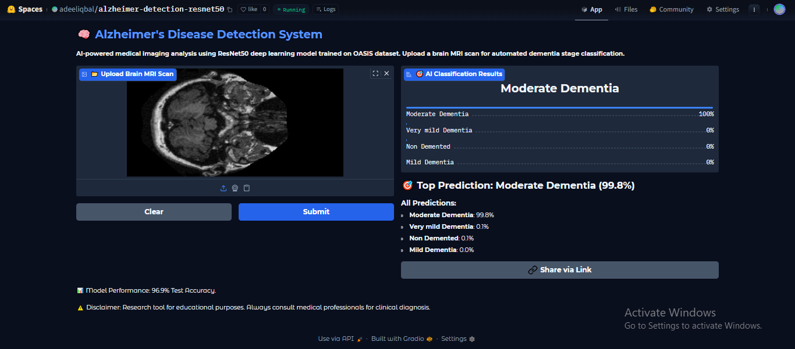

# 🧠 Alzheimer's Disease Detection System

Deep learning system for automated Alzheimer's disease detection from brain MRI scans. Achieves 96.9% accuracy using fine-tuned ResNet50 on OASIS dataset.

## Live Demo

🚀 **Try the live demo:** https://huggingface.co/spaces/adeeliqbal/alzheimer-detection-resnet50



## Overview

Deep Learning system for automated Alzheimer's disease detection from brain MRI scans using transfer learning with ResNet50 architecture. The system processes neuroimaging data from the OASIS (Open Access Series of Imaging Studies) dataset through comprehensive preprocessing, class balancing, and data augmentation techniques. Features a complete pipeline from model training to deployment with a professional web interface for real-time predictions. Achieves 96.9% accuracy across four dementia classification stages with balanced performance metrics.

The system can classify brain MRI images into four categories:
- **Non Demented** - Normal cognitive function
- **Very Mild Dementia** - Early stage cognitive decline
- **Mild Dementia** - Moderate cognitive impairment
- **Moderate Dementia** - Severe cognitive decline

## Features

- **High Accuracy**: Achieves 96.9% test accuracy with balanced performance across all classes
- **Transfer Learning**: Leverages pre-trained ResNet50 with fine-tuning for medical imaging
- **Data Augmentation**: Implements sophisticated augmentation techniques for minority class balancing
- **Web Interface**: User-friendly Gradio interface for easy interaction
- **Real-time Predictions**: Instant classification with confidence scores
- **Medical-themed UI**: Professional interface designed for healthcare applications

## Dataset

**OASIS (Open Access Series of Imaging Studies)**
- **Source**: [Kaggle OASIS Dataset](https://www.kaggle.com/datasets/ninadaithal/imagesoasis)
- **Total Images**: 86,437 brain MRI scans
- **Classes**: 4 dementia stages
- **Split**: 70% training, 15% validation, 15% testing
- **Preprocessing**: Data balancing and augmentation applied

### Class Distribution (After Balancing)
| Class | Training | Validation | Testing |
|-------|----------|------------|---------|
| Non Demented | 5,600 | 1,200 | 1,200 |
| Very Mild Dementia | 5,600 | 1,200 | 1,200 |
| Mild Dementia | 5,600 | 750 | 751 |
| Moderate Dementia | 5,600 | 73 | 74 |

## Model Architecture

**Base Model**: ResNet50 (Pre-trained on ImageNet)
- **Input Shape**: 224 × 224 × 3
- **Transfer Learning**: Frozen base layers with fine-tuned top 10 layers
- **Custom Layers**:
  - Global Average Pooling 2D
  - Dense layer (256 units, ReLU activation)
  - Output layer (4 units, Softmax activation)
- **Total Parameters**: 24.1M (4.99M trainable)

## Performance

### Test Results
- **Accuracy**: 96.9%
- **Loss**: 0.1016

### Per-Class Performance
| Class | Precision | Recall | F1-Score | Support |
|-------|-----------|--------|----------|---------|
| Mild Dementia | 0.98 | 0.98 | 0.98 | 751 |
| Moderate Dementia | 0.97 | 0.99 | 0.98 | 74 |
| Non Demented | 0.95 | 0.97 | 0.96 | 1,200 |
| Very Mild Dementia | 0.98 | 0.96 | 0.97 | 1,200 |

## Installation

### Prerequisites
- Python 3.8+
- CUDA-compatible GPU (recommended)

### Setup
1. **Clone the repository**
   ```bash
   git clone https://github.com/adeel-iqbal/alzheimer-detection-resnet50.git
   cd alzheimer-detection-resnet50
   ```

2. **Install dependencies**
   ```bash
   pip install -r requirements.txt
   ```

3. **Download the trained model**
   - The `best_resnet_model.h5` should be in the root directory
   - If missing, train the model using the provided Jupyter notebook

## Usage

### Web Application
Launch the Gradio interface:
```bash
python app.py
```
Navigate to `http://localhost:7860` in your browser.

### Jupyter Notebook
For training and experimentation:
```bash
jupyter notebook alzheimer-detection-resnet50.ipynb
```

### API Usage
```python
import tensorflow as tf
from PIL import Image
import numpy as np

# Load model
model = tf.keras.models.load_model("best_resnet_model.h5")

# Predict function
def predict_alzheimer(image_path):
    img = Image.open(image_path).resize((224, 224))
    img_array = np.array(img) / 255.0
    prediction = model.predict(np.expand_dims(img_array, axis=0))
    return prediction
```

## Project Structure

```
alzheimer-detection-resnet50/
│
├── app.py                                    # Gradio web application
├── alzheimer-detection-resnet50.ipynb       # Complete training pipeline
├── best_resnet_model.h5                     # Trained model weights
├── alzheimer-resnet50.keras                 # Alternative model format
├── requirements.txt                          # Python dependencies
├── image/
│   └── preview.png                          # Application preview
└── README.md                                # Project documentation
```

## Technical Details

### Data Preprocessing
- **Image Resizing**: 224×224 pixels for ResNet50 compatibility
- **Normalization**: Pixel values scaled to [0,1] range
- **Data Balancing**: Reduced majority classes and augmented minority classes
- **Train/Validation/Test Split**: 70/15/15 ratio

### Data Augmentation
Applied to minority classes during training:
- Rotation (±15 degrees)
- Width/Height shift (10%)
- Zoom (10%)
- Horizontal flip
- Brightness adjustment (80-120%)

### Training Configuration
- **Optimizer**: Adam (learning rate: 1e-5)
- **Loss Function**: Categorical Crossentropy
- **Batch Size**: 32
- **Epochs**: 17 (Early stopping implemented)
- **Callbacks**: ModelCheckpoint, EarlyStopping

## Results

### Training History
- **Best Epoch**: 14
- **Validation Accuracy**: 97.18%
- **Training completed in**: ~17 epochs with early stopping

### Confusion Matrix Results
The model demonstrates excellent performance across all classes with minimal misclassifications, particularly strong in distinguishing between different dementia stages.

## Disclaimer

⚠️ **Important Medical Disclaimer**

This system is designed for **research and educational purposes only**. It should not be used as a substitute for professional medical diagnosis or treatment. Key points:

- Always consult qualified healthcare professionals for medical diagnosis
- This tool is intended to assist medical professionals, not replace them
- Results should be interpreted by trained radiologists or neurologists
- The model's predictions should be considered supplementary information only

## Contributing

Contributions are welcome! Please feel free to submit issues, feature requests, or pull requests.

1. Fork the repository
2. Create a feature branch (`git checkout -b feature/improvement`)
3. Commit changes (`git commit -am 'Add new feature'`)
4. Push to the branch (`git push origin feature/improvement`)
5. Open a Pull Request

## Contact

**Adeel Iqbal Memon**
- Email: [adeelmemon096@yahoo.com](mailto:adeelmemon096@yahoo.com)
- LinkedIn: [linkedin.com/in/adeeliqbalmemon](https://linkedin.com/in/adeeliqbalmemon)
- GitHub: [github.com/adeel-iqbal](https://github.com/adeel-iqbal)

**Built with**: TensorFlow, Keras, Gradio, ResNet50, Python
